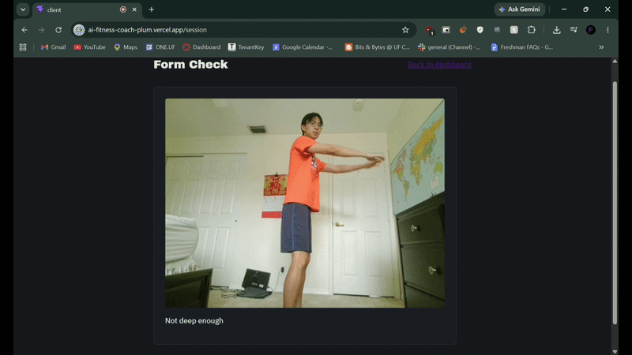

<!-- Badges -->
<p align="center">
  <a href="https://www.mongodb.com/"></a>
  <a href="https://expressjs.com/"></a>
  <a href="https://react.dev/"></a>
  <a href="https://nodejs.org/"></a>
  <a href="https://developers.google.com/mediapipe"></a>
</p>

<p align="center">
  <a href="https://ai.google.dev/"></a>
  <a href="https://render.com/"></a>
  <a href="https://vercel.com/"></a>
</p>

---

<h1 align="center">🏋️ AI Fitness Coach</h1>

<p align="center">
  <strong>Train smarter. Lift heavier. Never lose your form.</strong>
</p>

<p align="center">
  A full-stack fitness coach that logs your workouts, tells you exactly when to add weight using a real progressive-overload model, watches your squat form through your webcam in real time, and tracks calories from either a photo of your meal or a scan of its barcode. Built for myself and a handful of close friends who actually train — not a demo.
</p>

<p align="center">
  <a href="https://ai-fitness-coach-plum.vercel.app"></a>
</p>

<p align="center">
  <em>Free-tier hosting — the backend may take up to a minute to wake up on first load. Create a free account to explore the dashboard, progression logic, and squat tracker firsthand.</em>
</p>

<p align="center">
  
</p>

---

## Overview

I train five days a week and already used a fitness app daily, so I knew exactly what was missing from the generic trackers: **real progression logic**, not just a logbook, and **form feedback** that doesn't require a training partner standing next to you with a stopwatch.

AI Fitness Coach solves both. Log a workout with a target rep range and RIR (Reps In Reserve), and the app tells you whether to add weight, hold steady, or deload — based on how your actual sets performed, not a guess. Turn on your webcam before a squat and get live feedback on whether you hit real depth, powered by client-side pose estimation. Snap a photo of your meal and get a calorie estimate back from Gemini Vision, with the photo itself never stored anywhere. For packaged food, scanning the barcode skips the estimate entirely and pulls the manufacturer's own published numbers.

---

## How It Works

1. **Log a workout** — exercise, sets, reps, weight, a target rep range (e.g. 8–12), and RIR per working set. Warmup sets are tracked but never affect progression.
2. **Get a progression suggestion** — hit the top of your rep range at RIR ≤ 2, and the app suggests adding weight next session. Miss the bottom of the range two sessions in a row, and it suggests a deload instead.
3. **Build your split** — define named training days (Push, Pull, Legs, or anything else) and assign exercises to each. The dashboard shows progression grouped by day, and remembers your plan even through a training gap.
4. **Check your squat form** — enable your camera, and MediaPipe tracks your hip, knee, and ankle in real time, flagging "Good depth!" or "Not deep enough" the instant you complete a rep.
5. **Log a meal** — take or upload a photo, and Gemini Vision identifies the food and estimates its calories. The photo is analyzed and discarded — only the result is saved.
6. **Or scan a barcode** — for packaged food, point your camera at the barcode and the app looks up exact per-100g nutrition from Open Food Facts. Enter how many grams you actually ate and it scales the macros to match, saving the same shape of record the photo pipeline produces.

---

## Key Features

- **Rep-range-based progression** — a from-scratch algorithm modeling real double-progression training: single-session weight increases once you clear the top of your range at low RIR, but a more cautious two-session confirmation before suggesting a deload.
- **Routine/split builder** — define your own training days and see progression grouped by day, persisting through gaps rather than depending on what you happened to log most recently. Days are fully editable in place, so correcting a split never means deleting and rebuilding it.
- **Real-time pose-estimation form checking** — squat depth detection running entirely client-side, with dynamic left/right side selection based on which side of your body is actually visible to the camera.
- **Meal photo calorie estimation** — Gemini Vision analysis with a 7-model fallback chain, pooling multiple free-tier quotas into roughly 1,080 combined daily requests.
- **Barcode scanning** — client-side decoding via ZXing with an Open Food Facts lookup, giving exact manufacturer-published nutrition for packaged food instead of a model's estimate.
- **Multi-user auth with true data isolation** — every route filters by the verified JWT, not just the frontend, so one account can never see another's data even if the client were bypassed entirely.
- **Deployed and live** — real production hosting on Render and Vercel, not just a local demo.

---

## Engineering Highlights

- **Rebuilding the progression algorithm mid-project.** The original version used a fixed baseline and exact rep matching. Real training uses rep *ranges*, so the algorithm was rebuilt around warmup/working set tracking, per-set RIR, and an intentionally asymmetric rule — a single great session is enough evidence to add weight, but a deload needs two consecutive bad ones, since that's the more consequential call to get wrong.
- **Finding a hysteresis bug through data, not observation.** Inspecting real logged timestamps revealed multiple squat reps recorded within a couple of seconds — physically impossible. Ordinary standing sway was crossing the rep-detection threshold and back. Fixed with two independent safeguards: a minimum time between logged reps, and a separate, stricter threshold for *starting* to track a rep versus *ending* one — the same principle a thermostat uses to avoid rapidly flipping on and off at its target temperature.
- **Surviving a shared API rate limit.** Meal photo analysis hit a 429 from Gemini during testing. The error's short retry hint suggested a brief per-minute limit — but retrying still failed. Checking the live usage dashboard revealed both a per-minute *and* a per-day quota were exhausted. Since each Gemini model tracks its quota independently, the fix pools seven models into one fallback chain, turning a 20-request daily ceiling into roughly 1,080.
- **A React crash from a timing assumption.** Calling the pose-detection model before the video had real frame data threw an error inside a `useEffect` — and with no error boundary in the app, React's response was to unmount the entire component tree, not just the camera widget. Fixed with a readiness check and defensive error handling around every detection call.
- **A bug that hid itself by being `async`.** The barcode scanner opened the camera but seemed never to read anything, while the console filled with decode failures — which turned out to be normal per-frame misses, not the problem. The actual fault was one call to a method the scanning library removed in the version installed. That should have been a loud crash on the first successful scan, but because the callback was declared `async`, the error became an unhandled promise rejection that slipped past the library's own `try/catch`, silently skipping every line after it while the scan loop kept running. Generalizable lesson: handing an `async` callback to a library that invokes it inside a `try/catch` quietly disables that safety net.

See [`docs/decisions.md`](docs/decisions.md) for the full running log of every design decision and bug found during development.

---

## Tech Stack

### Frontend

- **React (Vite)** — component UI and build tooling
- **React Router** — client-side routing
- **Axios** — HTTP client with automatic JWT attachment
- **ZXing (`@zxing/browser`)** — client-side barcode decoding from the live camera feed

### Backend

- **Node.js / Express** — REST API
- **Mongoose** — MongoDB object modeling
- **JWT + bcrypt** — authentication and password hashing

### Data & AI

- **MongoDB Atlas** — primary database
- **MediaPipe Tasks Vision (PoseLandmarker)** — client-side pose estimation
- **Gemini Vision API (`@google/genai`)** — meal photo analysis, multi-model fallback
- **Open Food Facts API** — packaged-food nutrition lookup by barcode (open data, no API key needed)

### Deployment

- **Render** — backend hosting
- **Vercel** — frontend hosting

---

## Getting Started

### Prerequisites

- Node.js 18+
- A MongoDB Atlas account (free tier)
- A Gemini API key ([Google AI Studio](https://aistudio.google.com))

### Installation

1. Clone the repository:

```
git clone https://github.com/RyanXi11/AI-Fitness-Coach.git
cd AI-Fitness-Coach
```

2. Set up the backend:

```
cd server
npm install
cp .env.example .env
```

Fill in `.env` with your real values:

```
MONGO_URI=your_mongodb_atlas_connection_string
JWT_SECRET=your_random_secret
GEMINI_API_KEY=your_gemini_api_key
PORT=5000
```

3. Set up the frontend, in a separate terminal:

```
cd client
npm install
cp .env.example .env
```

```
VITE_API_URL=http://localhost:5000/api
```

4. Run both:

```
# Terminal 1
cd server && npm run dev

# Terminal 2
cd client && npm run dev
```

5. Open `http://localhost:5173` in your browser.

---

## Project Structure

```
AI-Fitness-Coach/
├── docs/
│   └── decisions.md          # running log of every design decision and bug found
├── server/
│   ├── models/                # User, Workout, MealLog, FormFeedback, RoutineDay
│   ├── routes/                # auth, workouts, mealLogs, formFeedback, routineDays
│   ├── middleware/
│   │   └── auth.js            # JWT verification
│   └── utils/
│       └── progression.js     # the progression algorithm
└── client/
    └── src/
        ├── components/        # CameraFeed, WorkoutForm, MealLogger, MealPhotoUpload, BarcodeScanner
        ├── pages/              # Dashboard, RoutineSettings, WorkoutSession
        └── context/
            └── AuthContext.jsx
```

---

## Credits

- **[MediaPipe](https://developers.google.com/mediapipe)** — real-time pose estimation
- **[Google Gemini](https://ai.google.dev/)** — meal photo analysis
- **[Open Food Facts](https://world.openfoodfacts.org/)** — open nutrition database behind barcode lookup
- **[ZXing](https://github.com/zxing-js/browser)** — in-browser barcode decoding
- **[MongoDB Atlas](https://www.mongodb.com/atlas)** — free-tier database hosting
- **[Render](https://render.com/)** / **[Vercel](https://vercel.com/)** — free-tier deployment
- **Cursor** — AI-powered IDE used throughout development

---

## Contact

- **Ryan Xi** — [LinkedIn](https://www.linkedin.com/in/ryan-xi)

---

## Future Roadmap

### Features

- [ ] Friend layer — visibility into friends' workouts and streaks, a simple leaderboard
- [ ] Push-up form checking, with its own real tuning pass against live data

### Things to improve

- [ ] **Camera-angle sensitivity** — depth is measured from a 2D projection, so the same real squat depth reads as a slightly different angle depending on camera height. Incorporating MediaPipe's depth (z) coordinate, or a calibration step using the user's own known-good rep, would make this more robust.
- [ ] **Per-user calibrated thresholds** — the depth threshold is currently one fixed value for everyone, not personalized to individual body proportions.

---

<p align="center">
  <em>Built by someone who actually uses it, five days a week.</em>
</p>
